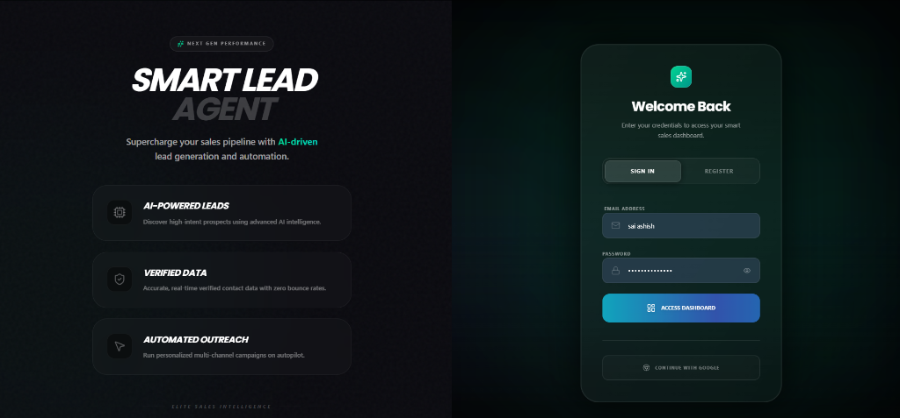
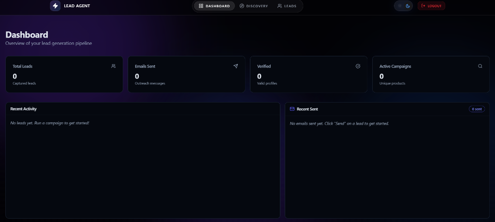
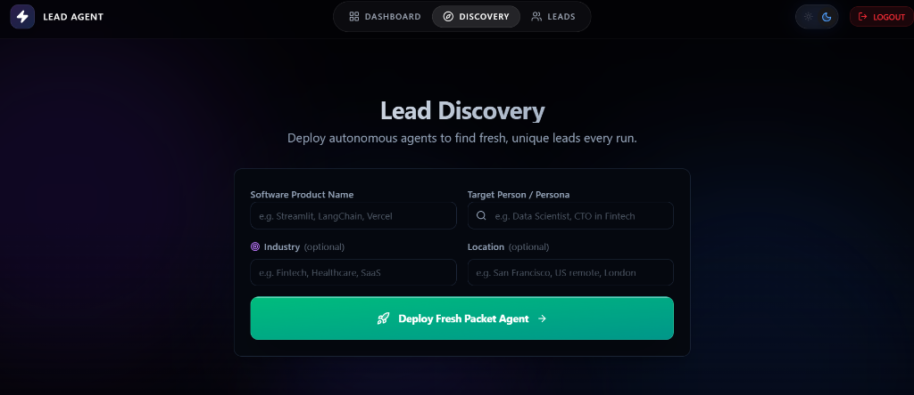
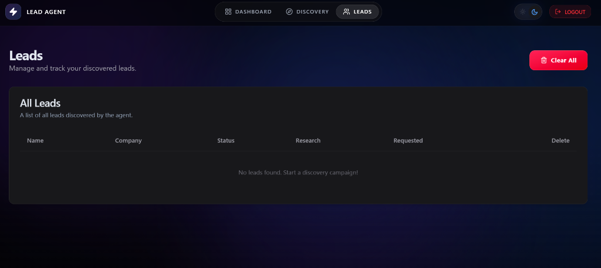

<div align="center">

# 🤖 Smart Lead Agent

### _Automate Your Entire Lead Generation Pipeline with Multi-Agent AI_

[](https://nextjs.org/)
[](https://flask.palletsprojects.com/)
[](https://www.langchain.com/)
[](https://groq.com/)
[](https://supabase.com/)
[](https://opensource.org/licenses/MIT)

> **Smart Lead Agent** is a production-ready, AI-native platform that replaces manual lead generation with a coordinated team of AI agents — discovering, enriching, verifying, and reaching out to leads at scale, automatically.

[🚀 Live Demo](#) · [📖 Docs](#setup--installation) · [🐛 Report Bug](https://github.com/saiashish13/smart-lead-agent/issues) · [✨ Request Feature](https://github.com/saiashish13/smart-lead-agent/issues)

</div>

---

## 📌 Overview

Most sales teams spend **70%+ of their time** on manual prospecting — sifting through LinkedIn, cold-emailing lists, and updating spreadsheets. Smart Lead Agent eliminates this entirely.

At its core, it is a **multi-agent AI system** where specialized agents collaborate in a pipeline: one discovers companies matching your Ideal Customer Profile, another enriches decision-maker data, a third validates and deduplicates the leads, and a final agent composes and sends hyper-personalized outreach emails — all running asynchronously in the background.

---

## 🚨 The Problem

| Pain Point | Reality |
|---|---|
| ⏱️ **Time Drain** | Sales reps spend hours manually researching prospects |
| 📉 **Data Quality** | Lead databases go stale fast — 30% decay annually |
| 🤖 **Generic Outreach** | Templated emails get ignored; personalization doesn't scale |
| 🔁 **No Automation** | Every step requires human intervention |

---

## ✅ The Solution

Smart Lead Agent introduces a **fully autonomous AI pipeline** that handles the entire top-of-funnel sales motion:

- 🔍 **Discover** companies matching your exact ICP criteria
- 🧩 **Enrich** every lead with decision-maker contacts and company intelligence
- ✅ **Verify** data accuracy and remove duplicates before they pollute your CRM
- ✉️ **Outreach** with AI-composed, deeply personalized emails at scale

---

## 🧠 Multi-Agent Architecture

> This is the core differentiator. Rather than a monolithic AI, each step is owned by a **specialized autonomous agent**.

```
┌──────────────────────────────────────────────────────────────────┐
│                    SMART LEAD AGENT PIPELINE                     │
│                                                                  │
│  ┌─────────────┐    ┌──────────────┐    ┌──────────────────┐    │
│  │  🔍 Research │───▶│ 🧩 Enrichment│───▶│ ✅ Verification  │    │
│  │    Agent     │    │    Agent     │    │     Agent        │    │
│  │             │    │              │    │                  │    │
│  │ Finds ICP-  │    │ Deep-dives   │    │ Deduplicates &   │    │
│  │ matched     │    │ into roles,  │    │ validates all    │    │
│  │ companies   │    │ contacts &   │    │ fields before    │    │
│  │ via Tavily  │    │ company info │    │ passing forward  │    │
│  └─────────────┘    └──────────────┘    └──────────────────┘    │
│                                                  │               │
│                                                  ▼               │
│                                        ┌──────────────────┐     │
│                                        │ ✉️ Outreach Agent │     │
│                                        │                  │     │
│                                        │ Generates & sends│     │
│                                        │ personalized AI  │     │
│                                        │ emails via Groq  │     │
│                                        └──────────────────┘     │
└──────────────────────────────────────────────────────────────────┘
```

| Agent | Responsibility | Tools Used |
|---|---|---|
| 🔍 **Research Agent** | Find companies matching ICP criteria | Tavily API, LangChain |
| 🧩 **Enrichment Agent** | Pull decision-maker contacts & company data | Groq LLaMA 3.1, LangChain |
| ✅ **Verification Agent** | Deduplicate, validate, and clean lead data | Custom logic + LLM |
| ✉️ **Outreach Agent** | Compose & send personalized cold emails | Groq, Flask-Mail |

---

## ⚡ System Workflow

```
User Inputs ICP (Niche, Role, Geography)
         │
         ▼
[Research Agent] ──── Tavily Web Search ────▶ Raw Company List
         │
         ▼
[Enrichment Agent] ── Groq + LangChain ─────▶ Enriched Lead Data
         │
         ▼
[Verification Agent] ─ Rule Engine + LLM ───▶ Clean, Deduped Leads
         │
         ▼
[Outreach Agent] ──── Groq Email Gen ───────▶ Personalized Emails Sent
         │
         ▼
Real-time Dashboard ←─ Celery + Redis ───────▶ Async Job Updates
```

---

## 🌟 Key Features

| Feature | Description |
|---|---|
| 🔍 **AI Lead Discovery** | Autonomous research using Tavily to surface ICP-matched companies |
| 🧩 **Deep Lead Enrichment** | LLM-powered extraction of roles, contacts, and company intelligence |
| ✅ **Data Verification** | Automated deduplication and validation before storage |
| ✉️ **Personalized Outreach** | AI-generated email copy tailored to each lead, sent automatically |
| 📊 **Real-time Dashboard** | Live pipeline visibility — track discovery, enrichment, and email status |
| ⚡ **Background Processing** | Celery + Redis task queue for fully non-blocking operations |
| 🔒 **Secure Auth** | JWT sessions + Google OAuth via Supabase |
| 📁 **Lead Management** | View, filter, export, and manage all leads in one place |

---

## 🏗️ Tech Stack

### Frontend
| Technology | Purpose |
|---|---|
| Next.js 15 (App Router) | Core framework with server components |
| React 19 | UI rendering |
| Tailwind CSS 4 | Styling system |
| Radix UI | Accessible component primitives |
| Framer Motion | Animations & transitions |
| TanStack Query | Server state management & caching |
| Lucide React | Icon system |

### Backend
| Technology | Purpose |
|---|---|
| Flask | REST API framework |
| Flask-SQLAlchemy | ORM & database layer |
| Celery + Redis | Async background task processing |
| Flask-JWT-Extended | JWT-based authentication |
| Flask-Mail | Email delivery |

### AI & Infrastructure
| Technology | Purpose |
|---|---|
| Groq (LLaMA 3.1) | Primary LLM for generation & reasoning |
| LangChain | Agent orchestration & tool chaining |
| Tavily API | Real-time web search for lead discovery |
| Supabase | Social login (Google OAuth) |

---

## 📂 Project Structure

```text
smart-lead-agent/
├── backend/
│   ├── app/
│   │   ├── agents/             # Research, Enrichment, Verification, Outreach Agents
│   │   ├── routes/             # API Blueprints (auth, leads, discovery, email)
│   │   ├── services/           # Business logic (storage, AI, mailer)
│   │   ├── models.py           # SQLAlchemy database schemas
│   │   └── .env                # Backend environment variables
│   ├── requirements.txt
│   └── run.py                  # Flask entry point
│
├── frontend/
│   ├── app/                    # Next.js App Router pages & layouts
│   ├── components/             # Reusable UI components
│   ├── lib/                    # API clients, hooks, utilities
│   ├── .env.local              # Frontend environment variables
│   └── package.json
│
├── start_app.bat               # One-click Windows startup script
└── README.md
```

---

## ⚙️ Setup & Installation

### Prerequisites
- Python 3.9+
- Node.js 18+
- Redis Server

### 1. Clone the Repository
```bash
git clone https://github.com/saiashish13/smart-lead-agent.git
cd smart-lead-agent
```

### 2. Backend Setup
```bash
cd backend
python -m venv venv
venv\Scripts\activate        # Windows
# source venv/bin/activate   # macOS/Linux
pip install -r requirements.txt
```

### 3. Frontend Setup
```bash
cd ../frontend
npm install
```

### 4. Configuration

#### `backend/app/.env`
```env
# Groq Configuration
GROQ_API_KEY=your_groq_api_key
GROQ_MODEL=llama-3.1-8b-instant

# Email Configuration
MAIL_USERNAME=your_email@gmail.com
MAIL_PASSWORD=your_gmail_app_password

# CSV Storage
CSV_FILE_PATH=leads.csv

# Tavily API Key
TAVILY_API_KEY=your_tavily_api_key

# Google OAuth (Google Cloud Console)
GOOGLE_CLIENT_ID=your_google_client_id
GOOGLE_CLIENT_SECRET=your_google_client_secret
FRONTEND_URL=http://localhost:3000

# Secret Keys
SECRET_KEY=your_super_secret_key
JWT_SECRET_KEY=your_jwt_secret_key
```

#### `frontend/.env.local`
```env
# Supabase Configuration
NEXT_PUBLIC_SUPABASE_URL=your_supabase_project_url
NEXT_PUBLIC_SUPABASE_ANON_KEY=your_supabase_anon_key

# App
NEXT_PUBLIC_SITE_URL=http://localhost:3000
```

### 5. Run the Application

**Windows (one-click):**
```bash
./start_app.bat
```

**Manual:**
```bash
# Terminal 1 – Backend
cd backend && python run.py

# Terminal 2 – Frontend
cd frontend && npm run dev

# Terminal 3 – Celery Worker
cd backend && celery -A app.celery worker --loglevel=info
```

---

## 📡 API Endpoints

| Category | Endpoint | Method | Description |
|---|---|---|---|
| **Auth** | `/auth/register` | `POST` | Create a new account |
| **Auth** | `/auth/login` | `POST` | Authenticate & receive JWT |
| **Auth** | `/auth/google` | `GET` | Initiate Google OAuth flow |
| **Leads** | `/leads/` | `GET` | Retrieve all saved leads |
| **Leads** | `/leads/<id>` | `DELETE` | Remove a specific lead |
| **Discovery** | `/discovery/` | `POST` | Trigger AI lead discovery pipeline |
| **Email** | `/email/send` | `POST` | Send personalized outreach email |

---

## 📸 Screenshots

### 🔑 Authentication


### 📊 Dashboard


### 🔍 Lead Discovery


### 📋 Lead Management


---

## 🛣️ Roadmap

| Status | Enhancement |
|---|---|
| 🔜 | CRM integrations (HubSpot, Salesforce) |
| 🔜 | LinkedIn profile scraping agent |
| 🔜 | Multi-step email sequence automation |
| 🔜 | A/B testing for outreach copy |
| 🔜 | Lead scoring & priority ranking |
| 🔜 | Slack / webhook notifications |
| 🔜 | SaaS billing with usage limits |

---

## 💡 Why This Project Stands Out

- **Multi-Agent Design** — Not a single monolithic AI call, but a coordinated pipeline of specialized agents with distinct responsibilities
- **Production-Ready Architecture** — Async task processing, JWT auth, structured API, and modular codebase built to scale
- **End-to-End Automation** — Covers the full top-of-funnel: discovery → enrichment → verification → outreach
- **Modern Full-Stack** — Combines the latest Next.js App Router, React 19, Flask 3, and frontier LLMs in one cohesive system

---

## 🤝 Contributing

Contributions are welcome and appreciated!

1. Fork the repository
2. Create your feature branch: `git checkout -b feature/your-feature`
3. Commit your changes: `git commit -m 'Add: your feature'`
4. Push to the branch: `git push origin feature/your-feature`
5. Open a Pull Request

---

## 📄 License

Distributed under the **MIT License**. See [`LICENSE`](./LICENSE) for details.

---

<div align="center">

## 👨‍💻 Author

**N Sai Ashish**

[](https://github.com/saiashish13)

_Built with precision, powered by AI._

⭐ **If this project helped you, please consider giving it a star!** ⭐

</div>
